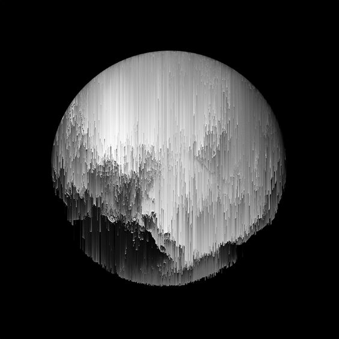
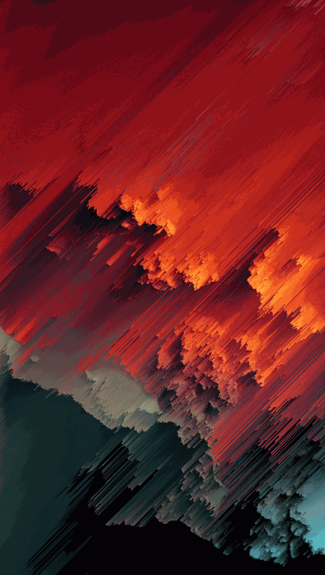
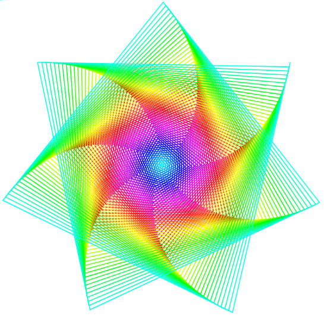

# tgon2993_9103_tut6
# Imaging Technique Inspiration

## The imaging technique of choice
These two pictures use different colors of lines, through a certain regular arrangement, to show a special visual effect. This technique is incorporated into subsequent projects and used to create abstract images or dynamic effects that enhance the visual appeal and artistic sense of the work.

## Selection Reason
This technique will be useful for subsequent projects. Because of their line drawing methods and dynamic effects, they can effectively help me draw artworks. In addition, they also help to add a unique artistic style and expression to the work, improving the art and creativity of the work.

# Coding Technique Exploration

## How to help
This code example uses the random number generation, Angle calculation and color pattern functions in the p5.js library to draw lines. It can be used as a basis to refer to the line drawing techniques in it and combine with other techniques to achieve the desired effect of drawing line art in the next project.

For example, we can adjust the parameters in the createPattern function to control the shape and color of the lines, so that the resulting pattern is closer to the desired effect.

[Coding Technique Link ](https://editor.p5js.org/ICantRemember/sketches/QqjpuLphA)

## Refence
> P5.js Showcase. (n.d.). Retrieved May 1, 2024, from https://showcase.p5js.org/#/2022-All/pattern-creator/
> Rafal Bromirski: Behance. (n.d.). Retrieved May 1, 2024, from https://www.behance.net/rafalbromirski